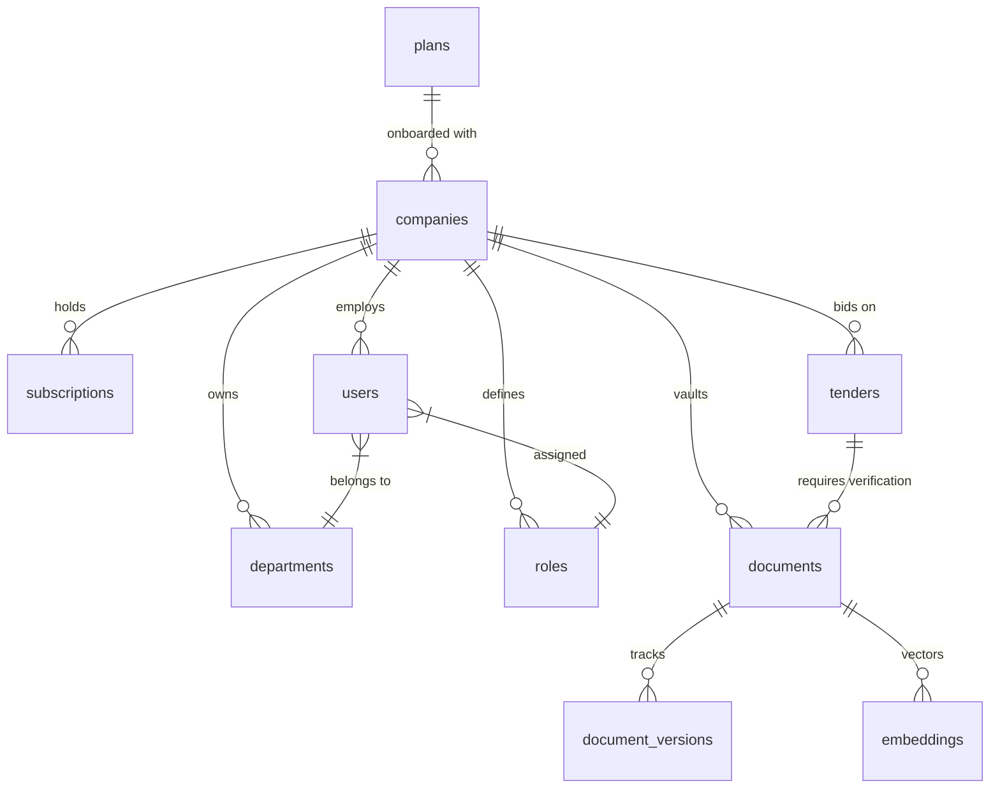

<<<<<<< HEAD
# Tender AI - Enterprise Bidding & Document Verification Console

Tender AI is a state-of-the-art, multi-tenant enterprise SaaS platform designed for bid management, tender document verification, and AI-assisted compliance analysis. It enables companies to upload bid evidence (certificates, credentials, financial records) to an isolated document vault, automatically parse and extract key entities, index the content with vector embeddings, and verify compliance against seeded government tenders using automated RAG (Retrieval-Augmented Generation) pipelines.

---

## 🌟 Key Features & Capabilities

- **Multi-Tenant Architecture**: Robust company isolation at both database (PostgreSQL Row-Level Security) and directory storage levels.
- **Granular RBAC (Role-Based Access Control)**:
  - `PLATFORM_ADMIN` (Super Admin): Global configuration, organization/tenant onboarding, system-wide settings, globally seeded tenders, and user audit trails.
  - `COMPANY_OWNER`: Company subscription management, department organization, billing control, and tenant-level user provisioning.
  - `COMPANY_ADMIN`: Assignment of open tenders to staff, review and approval of bid proposals, and document compliance checks.
  - `EMPLOYEE / STAFF` (Bid Managers, Writers, Reviewers): Proposal drafting, task boards, document uploading, and AI assistant chat interactions.
- **Asynchronous Document Analysis Pipeline**:
  - Automatically processes files in background stages: `queued` ➔ `extracting` ➔ `analyzing` (LLM structured entity extraction) ➔ `embedding` (generating 1536-dimensional vector representations) ➔ `indexed` (searchable in RAG store).
- **RAG-Powered Tender Matcher**:
  - Dynamically runs compliance checks between company documents and tender criteria.
  - Identifies eligibility gaps, scores overall compatibility, and pinpoints exactly where in the source documents compliance conditions are met.
- **Security & Stability Out-of-the-Box**:
  - Implements **Helmet** security headers to block common vulnerabilities (XSS, Clickjacking, MIME sniffing).
  - Configured with global **Express Rate-Limiting** to mitigate API abuse.
  - **Argon2** password hashing & secure JSON Web Token (JWT) sessions.

---

## 🏗️ Repository Architecture & Layout

```text
Legal-tenders/
├── backend/
│   ├── src/
│   │   ├── config/             # Connection configurations (e.g. Supabase client setup)
│   │   ├── controllers/        # Express handlers (auth, tenders, billing, orgs, RAG)
│   │   ├── middleware/         # Token validation, tenant isolation, rate limiters
│   │   ├── repositories/       # Isolated DB access models (documents, tenders)
│   │   ├── routes/             # Modular express endpoints
│   │   ├── services/           # Async task scheduling & tender eligibility matchers
│   │   └── utils/              # audit logging & common utilities
│   ├── migrations/             # SQL setup files (Schema, RLS rules, RPCs, Vector Indexes)
│   ├── models/                 # Additional helper schemas
│   ├── server.js               # Express application entrypoint
│   └── package.json
│
├── frontend/
│   ├── src/
│   │   ├── components/         # Reusable widgets (upload vault, cards, table elements)
│   │   ├── context/            # AuthContext (keeps track of tenant identity & roles)
│   │   ├── layouts/            # Sidebar dashboard wrappers
│   │   ├── pages/              # Role-specific workspaces (SuperAdmin, Owner, Admin, Employee)
│   │   ├── routes/             # AppRoutes & protected router guards
│   │   ├── styles/             # Global CSS and Tailwind definitions
│   │   └── main.jsx            # Application bootstrap
│   ├── tailwind.config.js      # Tailwind style tokens
│   ├── vite.config.js          # Vite build options
│   └── package.json
│
└── docker-compose.yml          # Container stack orchestration (Backend, Frontend, Redis)
```

---

## 🗄️ Database Schema Model

The database setup utilizes PostgreSQL inside Supabase, featuring pgvector for RAG indexing and strict Row-Level Security (RLS) to enforce tenant isolation.



### Key Core Tables
1. **`companies`**: Tenant accounts mapping sub-domains, industry sector metadata, and subscription licenses.
2. **`users`**: Managed users belonging to specific companies, hashed with Argon2, assigned a role and department.
3. **`tenders`**: Multi-tenant bidding opportunities, mapping milestones, budgets, assignees, and compliance statuses.
4. **`documents`**: Tracked company certificates, financial statements, and experience evidence with status trackers (`queued`, `extracting`, `analyzing`, `embedding`, `indexed`).
5. **`embeddings`**: Houses generated chunk text and associated `VECTOR(1536)` entries for cosine similarity searching.
6. **`audit_logs`**: Capture records of security-relevant operations for all tenants to satisfy compliance auditing.

---

## 🚀 Setup & Execution Guide

### 1. Environment Preparation
Create a `.env` configuration file in the `/backend` folder:
```env
PORT=5000
JWT_SECRET=tender_management_secure_jwt_token_secret_998811
SUPERADMIN_EMAIL=superadmin@tender.ai
SUPERADMIN_PASSWORD=SuperSecurePassword123

# Supabase PostgreSQL Configuration
SUPABASE_URL=https://<your-project>.supabase.co
SUPABASE_SERVICE_ROLE_KEY=<your-service-role-key>

# RLS Mode configuration (Enforces SQL-level RLS validation)
ENFORCE_RLS_IN_BACKEND=true
```

### 2. Launching the Stack

#### Option A: One-Command Docker Compose (Recommended)
This launches the Node.js API server, the React/Vite development server, and a Redis message broker automatically:
```bash
docker-compose up --build
```

#### Option B: Independent Dev Processes

1. **Start Backend Server**:
   ```bash
   cd backend
   npm install
   npm run dev
   ```
   *API Gateway URL: http://localhost:5000*

2. **Start Frontend Portal**:
   ```bash
   cd frontend
   npm install
   npm run dev
   ```
   *Web Application URL: http://localhost:3000*

---

## 🔌 Core API Endpoints

### 🔑 Authentication (`/api/auth`)
* `POST /api/auth/register` - Tenant registration (onboards Company, Owner Profile, default Plan, and Subscriptions)
* `POST /api/auth/login` - Secure login endpoint returning JWT and user session metadata

### 📂 Document Vault & AI RAG Pipeline (`/api/documents`)
* `POST /api/documents` - Upload evidence files. Initiates background analysis worker immediately and returns `{ id, filename, processing_status: "queued" }`.
* `GET /api/documents/:id/status` - Poll the extraction and vector indexing status.

### 📝 Bid Compliance Matcher (`/api/tender-reg`)
* `POST /api/tender-reg/companies/:compId/documents/:docId/match` - Triggers AI compliance evaluator to cross-reference extracted document facts with pre-seeded tender requirements. Returns match confidence scoring and requirement satisfaction tables.
=======
# GemAudit
>>>>>>> 509ad4598f21af3549a7e3f66f61e70b123a0a36
