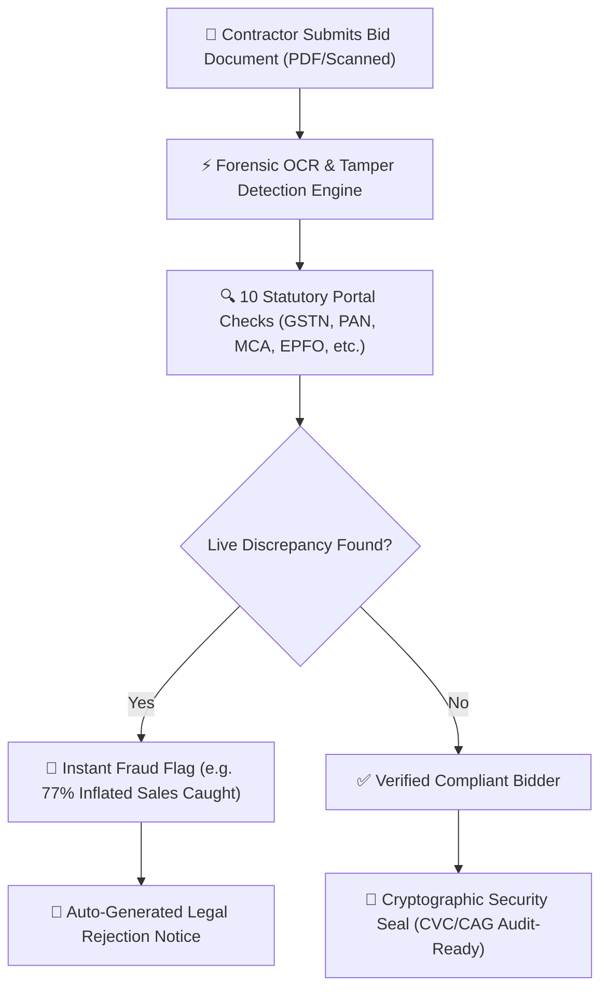
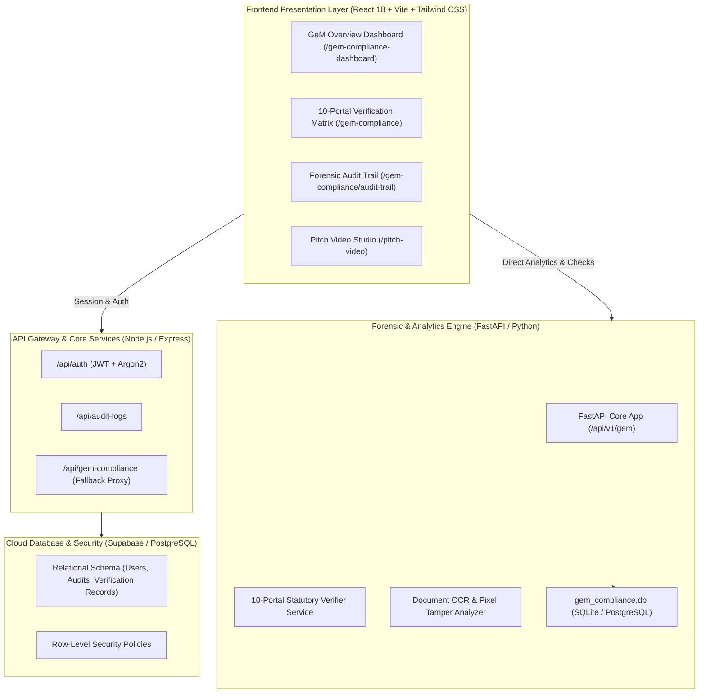

# 🏛️ GeM Audit AI: Comprehensive Team Handoff & Architecture Guide

> **Target Audience:** Engineering Team Members, Product Managers, and Technical Collaborators  
> **Platform Name:** GeM Audit AI (Government e-Marketplace Bid Verification & Forensic Platform)  
> **Repository:** `leagal_tender(2)` / `Legal-tenders`  
> **Last Updated:** September 14, 2026  
> **Document Purpose:** Complete technical onboarding, system architecture, feature breakdown, setup instructions, and development context for GeM Audit AI.

---

## 📑 Table of Contents
1. [Executive Summary & Platform Vision](#1-executive-summary--platform-vision)
2. [End-to-End System Architecture](#2-end-to-end-system-architecture)
3. [Technology Stack](#3-technology-stack)
4. [Core Platform Capabilities](#4-core-platform-capabilities)
   - [A: 10-Portal Statutory Multi-Registry Check](#a-10-portal-statutory-multi-registry-check)
   - [B: Interactive AI Document OCR & Forensic Workspace](#b-interactive-ai-document-ocr--forensic-workspace)
   - [C: Tamper-Evident Cryptographic Audit Trail](#c-tamper-evident-cryptographic-audit-trail)
   - [D: The 48-Hour Seller Clarification Helper](#d-the-48-hour-seller-clarification-helper)
   - [E: Pitch Video Studio & Motion Player](#e-pitch-video-studio--motion-player)
5. [Database & Service Models](#5-database--service-models)
6. [Repository Codebase Map](#6-repository-codebase-map)
7. [Feasibility, Viability & Business Potential](#7-feasibility-viability--business-potential)
8. [Local Development & Setup Guide](#8-local-development--setup-guide)
9. [Key Technical Lessons & Robustness Solutions](#9-key-technical-lessons--robustness-solutions)
10. [Immediate Roadmap & Next Milestones](#10-immediate-roadmap--next-milestones)

---

## 1. Executive Summary & Platform Vision

India processes over **₹4,00,000+ Crore ($48B+)** in public procurement every year across **GeM (Government e-Marketplace)** and **CPPP (Central Public Procurement Portal)**.

### The Problem
- **Manual Verification Latency:** Procurement officers spend **5 to 7 days per tender** manually sifting through hundreds of pages of vendor balance sheets, experience letters, and tax certificates.
- **Rampant Procurement Fraud:** Dishonest contractors submit photoshopped balance sheets, fabricated MSME exemptions, fake manpower claims, or conceal debarment and blacklisting records.
- **Costly Project Delays:** Insolvent shell companies win contracts, then stall critical public infrastructure projects for years.

### The Solution: GeM Audit AI
**GeM Audit AI** is an enterprise forensic GovTech platform built for public procurement evaluators and vigilance officers. It:
1. Automatically extracts data from submitted bid documents via forensic OCR.
2. Cross-references vendor claims against **10 official statutory government databases** in under **3 seconds**.
3. Detects document tampering, font mismatches, and inflated turnover figures (e.g., catching ₹18.4 Cr claimed vs. ₹4.2 Cr actual GST filings).
4. Locks all verification decisions with **cryptographic digital security seals** (`SHA-256`), providing unalterable proof for CVC and CAG audit compliance.
5. Cuts evaluation timelines from **7 days down to 8 minutes (a 96% reduction)**.



---

## 2. End-to-End System Architecture



---

## 3. Technology Stack

| Layer | Technologies | Role & Advantage |
| :--- | :--- | :--- |
| **Frontend UI** | React 18, Vite, Tailwind CSS, Lucide React, FontAwesome | Fast, responsive, dark-mode glassmorphism interface |
| **Forensic Backend** | Python 3.10+, FastAPI, Uvicorn, SQLAlchemy, Pydantic | High-performance asynchronous statutory API verifications and OCR |
| **Gateway Backend** | Node.js, Express.js, Helmet, Argon2, JWT | Enterprise session security, rate-limiting, and central API routing |
| **Databases** | PostgreSQL (Supabase) & SQLite (`gem_compliance.db`) | Production cloud storage with local zero-config testing cache |
| **Speech & Audio** | Microsoft Edge-TTS (`generate_voiceovers.py`), HTML5 Canvas | Cinematic AI studio player for investor & stakeholder demos |

---

## 4. Core Platform Capabilities

### A: 10-Portal Statutory Multi-Registry Check
The platform queries 10 authoritative public registries simultaneously:
1. **GSTN (Goods & Services Tax Network):** Validates active filing status, 3B/GSTR-1 regularity, and turnover veracity.
2. **PAN / Income Tax Dept:** Verifies legal entity identity and direct tax standing.
3. **MCA-21 / ROC:** Confirms Registrar of Companies status, authorized share capital, active directors, and DIN numbers.
4. **EPFO:** Verifies real worker contributions against claimed staff counts to stop ghost worker claims.
5. **ESIC:** Checks Employee State Insurance compliance for labor/manpower bids.
6. **GeM Debarment / Blacklist:** Cross-references national blacklists across central and state ministries.
7. **MSME Udyam Portal:** Validates Micro/Small enterprise certificate authenticity for price preference exemptions.
8. **ISO / QCI Accreditation:** Authenticates ISO certifications with certified accreditation registries.
9. **CPPP (Central Public Procurement Portal):** Detects simultaneous bids or debarments on other government tenders.
10. **Commercial Credit / CIBIL:** Assesses financial solvency and default risks.

### B: Interactive AI Document OCR & Forensic Workspace
- **Pixel & Metadata Tampering:** Spots font inconsistencies, altered dates, and digitally manipulated amounts on uploaded PDF certificates.
- **Cross-Claim Verification:** Directly compares figures written in the bid against live tax filings (e.g. catches ₹18.40 Cr claimed vs. ₹4.20 Cr tax return).

### C: Tamper-Evident Cryptographic Audit Trail
- Every verification step, score, and decision is locked with a permanent digital hash (`SHA-256` timestamped seal).
- Guaranteed unalterable and legally admissible for CVC (Central Vigilance Commission) and CAG audits.

### D: The 48-Hour Seller Clarification Helper
- GeM rules allow vendors only 48 hours to reply to buyer clarifications or face automatic rejection.
- The platform flags clarification notices and rapidly identifies the required past proof documents to respond accurately within minutes.

### E: Pitch Video Studio & Motion Player
- Located in `pitch_video_studio.html` and `PitchVideoStudioPage.jsx`.
- Cinematic presentation studio with synced Edge-TTS voiceovers and animated visual overlays.

---

## 5. Feasibility, Viability & Business Potential

| Dimension | Key Proof & Value Delivered |
| :--- | :--- |
| **Feasibility** | • **Infrastructure Reusability:** Plugs directly into GeM/CPPP workflows and live public APIs.<br>• **Low Compute Overhead:** In-memory OCR and checks run at ~₹5–₹10 per tender.<br>• **Officer Co-Pilot:** Strict manual override and one-click rejection notice drafting. |
| **Viability** | • **Builds Public Trust:** Algorithmic checking removes officer bias and discretionary favoritism.<br>• **Guarantees Accountability:** Cryptographic digital seals ensure 100% CVC/CAG audit-readiness.<br>• **Proven Demand:** GeM processes over ₹4,00,000+ Crore in bids across 150,000+ buyers. |
| **Business Potential** | • **Government Cost Savings:** Slashes tender review time from 7 days to 8 minutes (96% faster).<br>• **B2G & Enterprise Licensing:** Annual procurement SaaS licensing for Ministries, PSUs, and defense buyers. |

---

## 6. Repository Codebase Map

```text
leagal_tender(2)/
├── TEAM_HANDOFF_AND_PROJECT_GUIDE.md   # This official onboarding guide
├── TEAM_HANDOFF_AND_PROJECT_GUIDE.html # Browser-ready HTML version with Print/PDF export
│
└── Legal-tenders/
    ├── pitch_video_studio.html         # Interactive Pitch Studio Player
    ├── generate_voiceovers.py          # Edge-TTS script generating slide audio
    ├── audio/                          # Pre-rendered voiceover audio files (.mp3)
    ├── images/                         # Architectural diagrams and screenshot assets
    │
    ├── fastapi_backend/                # Python / FastAPI Forensic Verification Service
    │   ├── main.py                     # FastAPI entrypoint (/api/v1/gem)
    │   ├── database.py                 # SQLite / PostgreSQL engine config
    │   ├── models.py                   # SQLAlchemy schema for 10 statutory checks
    │   ├── schemas.py                  # Pydantic request/response validation
    │   ├── seed_data.py                # Pre-seeded test bids & statutory records
    │   ├── gem_compliance.db           # Local database for fast testing
    │   ├── routers/                    # Verification, analytics, and audit trail endpoints
    │   └── services/                   # Multi-portal check logic & forensic OCR analysis
    │
    ├── backend/                        # Node.js / Express Gateway Backend
    │   ├── .env.example                # Backend environment variables
    │   ├── server.js                   # Express server entrypoint
    │   └── src/                        # Auth, routing, and audit logger middleware
    │
    └── frontend/                       # React 18 + Vite Frontend Portal
        ├── src/
        │   ├── routes/AppRoutes.jsx    # Complete application route map
        │   ├── pages/gemVerification/  # GeM compliance, audit trail & analytics pages
        │   ├── pages/pitchVideo/       # Pitch Video Studio view
        │   └── services/gemService.js  # API connector with automatic offline demo fallback
```

---

## 7. Local Development & Setup Guide

### 1. Start the FastAPI Forensic Backend (Recommended)
```bash
cd Legal-tenders/fastapi_backend
python -m venv .venv
# Windows:
.venv\Scripts\activate
# macOS/Linux: source .venv/bin/activate

pip install -r requirements.txt
python -m uvicorn main:app --reload --port 8000
```
> Interactive API Docs: `http://localhost:8000/docs`

### 2. Start the Frontend Application
```bash
cd Legal-tenders/frontend
npm install
npm run dev
```
> Web Application: `http://localhost:3000`

---

*Authored for the GeM Audit AI Platform Team.*
