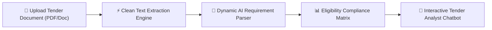
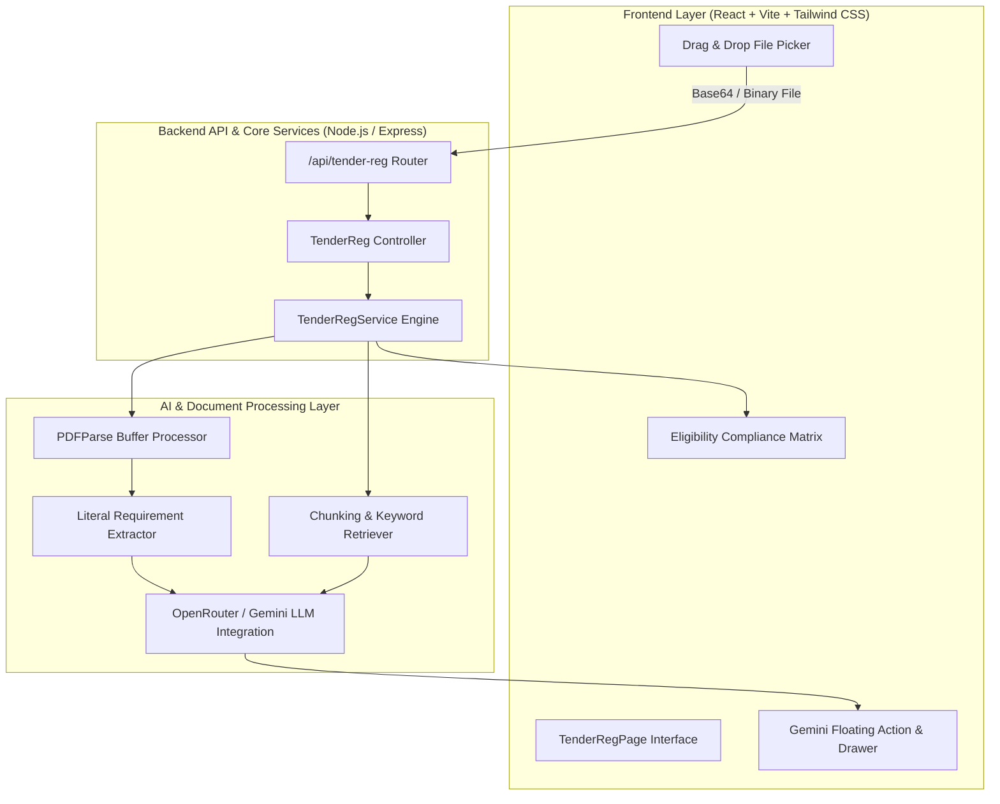
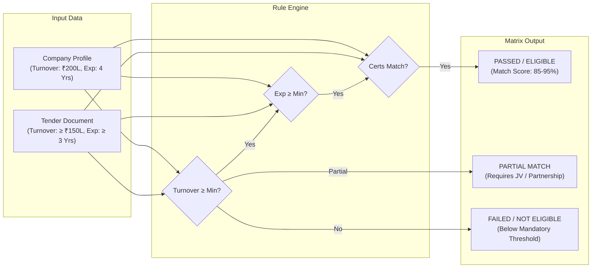
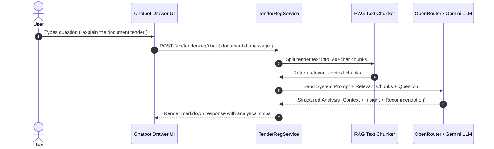

# AI Legal Tender Evaluation & Analyst Platform: Technical & System Architecture Report

## 1. Executive Summary & Core Platform Vision

The **AI Legal Tender & Qualification Platform** is an enterprise solution designed to automate government tender eligibility assessment, document analysis, and qualification decision-making. 

### Core Capabilities
- **Automated Qualification**: Evaluates company profiles against complex tender specifications in under 10 seconds.
- **Dynamic Unstructured Document Parsing**: Extracts clean, plain text from uploaded PDF/Word tender documents.
- **Literal Document Grounding**: Guarantees zero hallucinated numbers; evaluates strictly against document text.
- **RAG-Grounded Analyst Chatbot**: Interactive AI assistant providing contextual Q&A, risk analysis, and rough bid estimations.



---

## 2. End-to-End System Architecture

The application is structured into a modern decoupled architecture:



---

## 3. Document Ingestion & Text Sanitization Pipeline

### 3.1 PDF Processing & Buffer Decoding
When a user uploads a document (e.g. `RPF.pdf`):
1. **Client-Side Base64 Encoding**: `FileReader.readAsDataURL()` converts the file payload to Base64 data URLs.
2. **Server-Side Buffer Decoding**: Node.js receives the Base64 stream and decodes it into a binary Buffer.
3. **PDF Stream Extraction (`PDFParse`)**: The server runs `PDFParse` over the buffer to extract text objects.

### 3.2 Binary Header & Metadata Filtering
If unparsed PDF streams or raw headers (`%PDF-1.4`, `/Type /Page`, `<< >>`, `/ProcSet`, `endobj`) remain in the text, a multi-pass regex filter strips out PDF structural code line-by-line while retaining clean human-readable plain text.

### 3.3 False-Positive Prevention (PDF `/Length 3000` Fix)
PDF binary headers contain object size tags like `/Length 3000` or `/L 3000`. To prevent single-letter regex matchers from mistaking `/L 3000` for `3000 Lakhs`, the extraction engine requires explicit monetary terms (`turnover`, `revenue`, `financial`, `annual`, `INR`, `₹`) paired with explicit units (`lakh`, `lakhs`, `crore`, `cr`).

```
[Raw PDF Upload] ➔ [Base64 Stream] ➔ [PDFParse Buffer] ➔ [Binary Filter] ➔ [Clean Plain Text]
```

---

## 4. Dynamic Requirement Extractor Engine

The extraction engine parses unstructured tender text into structured JSON metrics:

| Extracted Field | Extraction Mechanism | Validation & Grounding Rule |
| :--- | :--- | :--- |
| **Project Title** | Header Parsing / LLM | Extracted directly from title block or filename |
| **Annual Financial Turnover** | Contextual Regex + LLM | Must contain explicit financial terms; defaults to `Not Specified` if absent |
| **Operating Experience** | Temporal Pattern Matching | Matches `N years / yrs` operating experience |
| **Mandatory Certifications** | Domain Keyword Recognition | Scans for `ISO 9001`, `Class A Electrical License`, `MNRE`, `ISO 27001`, etc. |

### Extracted JSON Structure
```json
{
  "title": "10MW Grid-Connected Rooftop Solar Power Plant",
  "department": "State Renewable Energy Development Agency",
  "sector": "Electrical & Solar Energy",
  "min_turnover_lakhs": 150,
  "min_years_experience": 3,
  "required_certifications": ["ISO 9001", "Class A Electrical License"]
}
```

---

## 5. Deterministic Eligibility Compliance Matrix

The qualification engine uses a dual-layer evaluation strategy:



### Compliance Status Tokens
- **PASSED**: Company profile meets or exceeds mandatory tender thresholds.
- **PARTIAL**: Company meets partial criteria; requires joint venture or sub-contracting.
- **FAILED**: Company falls below minimum required thresholds.

---

## 6. Tender Analyst Chatbot (RAG Engine)

The contextual chatbot utilizes Retrieval-Augmented Generation (RAG) to ground answers in the uploaded document:



### Key Chatbot Capabilities
1. **Document Context Summarization**: Summarizes core project deliverables and timelines.
2. **Analytical Risk Interpretation**: Explains compliance requirements and risks.
3. **Rough Bid Estimation**: Provides rough cost breakdown models based on scope.
4. **Strategic Opportunity Guidance**: Highlights competitive positioning for future bids.

---

## 7. UI/UX Interface Architecture

```
 ┌────────────────────────────────────────────────────────────────────────┐
 │ ⚡ TENDER ANALYSIS PLATFORM                                             │
 ├────────────────────────────────────────────────────────────────────────┤
 │ [Step 1: Company Profile] ➔ [Step 2: Upload Tender] ➔ [Step 3: Matrix] │
 ├────────────────────────────────────────────────────────────────────────┤
 │ 🛡️ ELIGIBILITY COMPLIANCE MATRIX                                      │
 │ Evaluation Criterion     Required Spec       Company Provided   Status │
 │ Annual Turnover          ≥ ₹150 Lakhs        ₹200 Lakhs         PASSED │
 │ Operating Experience     ≥ 3 Years           4 Years            PASSED │
 │ Certifications           ISO 9001, Class A   ISO 9001, Class A   PASSED │
 ├────────────────────────────────────────────────────────────────────────┤
 │                                                    [✨ Gemini AI Chat] │
 └────────────────────────────────────────────────────────────────────────┘
```

- **Glowing Floating Action Button**: Fixed action trigger launching the assistant drawer.
- **Slide-up Popup Drawer**: Smooth animation drawer containing chat history, prompt chips, and input field.
- **Quick Prompt Chips**: One-click prompt shortcuts for instant document analysis.
- **Persistent Disclaimer**: Legal notice clarifying AI outputs serve as decision-support tools.

---

## 8. Technology Stack & Data Privacy

- **Frontend**: React.js, Vite, Tailwind CSS, Lucide Icons, Vanilla CSS Glassmorphism.
- **Backend**: Node.js, Express.js, RESTful Endpoints.
- **Document Processing**: `pdf-parse`, Custom Regex Parsing Engines.
- **LLM Integrations**: OpenRouter (`openai/gpt-oss-20b:free`), Google Gemini API.
- **Data Privacy**: Ephemeral in-memory processing guarantees uploaded tender documents remain secure.
